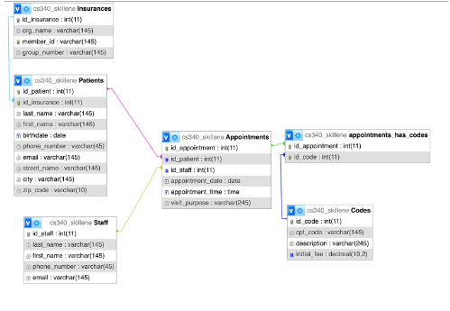

# Overview: 

Welcome to the Database Demo Website repository! This project showcases a simple web application that performs **CRUD** (Create, Read, Update, Delete) operations using Node.js, MySQL, JavaScript, Express, CSS, and HTML. The website is hosted on a **Plesk** server through **AWS** (Amazon Web Services). 

### Website: [https://emmademo.com]

### Technologies Used:
1. **Node.js**: The server-side environment for running JavaScript code.
2. **MySQL**: A relational database management system for data storage.
3. **JavaScript**: Used for server-side logic and client-side interactions.
4. **Express**: A Node.js web application framework for building APIs and web apps.
5. **CSS** and **HTML**: Frontend technologies for styling and structuring the web pages.
6. **Plesk** Server on **AWS**: The hosting environment for deploying the website.

### Features:
##### Create
* Add new data to the database by filling out forms on the website.
##### Read 
* Retrieve and view existing data from the database.
##### Update 
* Modify and update data entries stored in the database.
##### Delete
* Remove data entries from the database.

### Background:
        A private doctor’s office is currently using two different systems to keep 
        track of billing and patient services. Due to its influx of newly admitted 
        patients, the average number of patients this clinic sees has recently 
        doubled from 25 to 50. This office has only 5 providers and is a primary 
        doctor’s office thus there are no procedures or surgeries. With each 
        appointment ranging from 200$ - 500$, the private business makes around 
        3,600,000$ - 9,000,000$ annually.

        
        In the past, the receptionists have spent too much time toggling between 
        two systems which takes too much time and is more prone to system transfer 
        errors. Due to the increase in patients and the use of two separate systems, 
        this has resulted in patients being overbilled, underbilled, and made it 
        difficult for the staff working as receptionists to answer billing questions 
        from patients. 
        
    
        This new database will combine both systems to increase functionality and 
        accessibility for both staff and patients. Due to SQL’s capability of 
        holding over 2 million objects, this will also allow the private clinic 
        room to grow if they decide to intake more patients, without sacrificing 
        time or energy for reception staff. Each appointment needs a corresponding 
        CPT code, and having both the appointment details and the CPT code in the 
        same database system will eliminate redundancy, mistakes, and make it easier 
        for insurances to be billed out. Oftentimes, insurance companies require 
        both CPT codes and progress notes from the doctors, and putting those in the 
        same system makes it far easier for employees to get prior authorizations, 
        approvals, and advocate for their patients. 

### Database:
The database is hosted through on **phpMyAdmin** via **Plesk**

Here is the schema of our database:
<picture>
 <source media="(prefers-color-scheme: dark)" srcset="schema.png">
 <source media="(prefers-color-scheme: light)" srcset="schema.png">
 
</picture>

### Citations:

Dr. Curry and Prof. Safonte (August 2023) Citing source code (Version 16.13.0) [Source code] https://github.com/osu-cs340-ecampus/nodejs-starter-app/blob/main/README.md

mdn web docs (August 2023) Citing date display functions (Version 16.13.0) [Date Display Code] https://developer.mozilla.org/en-US/docs/Web/JavaScript/Reference/Global_Objects/Date/toLocaleDateString

Co-Creator: Brynn DeVaan 
